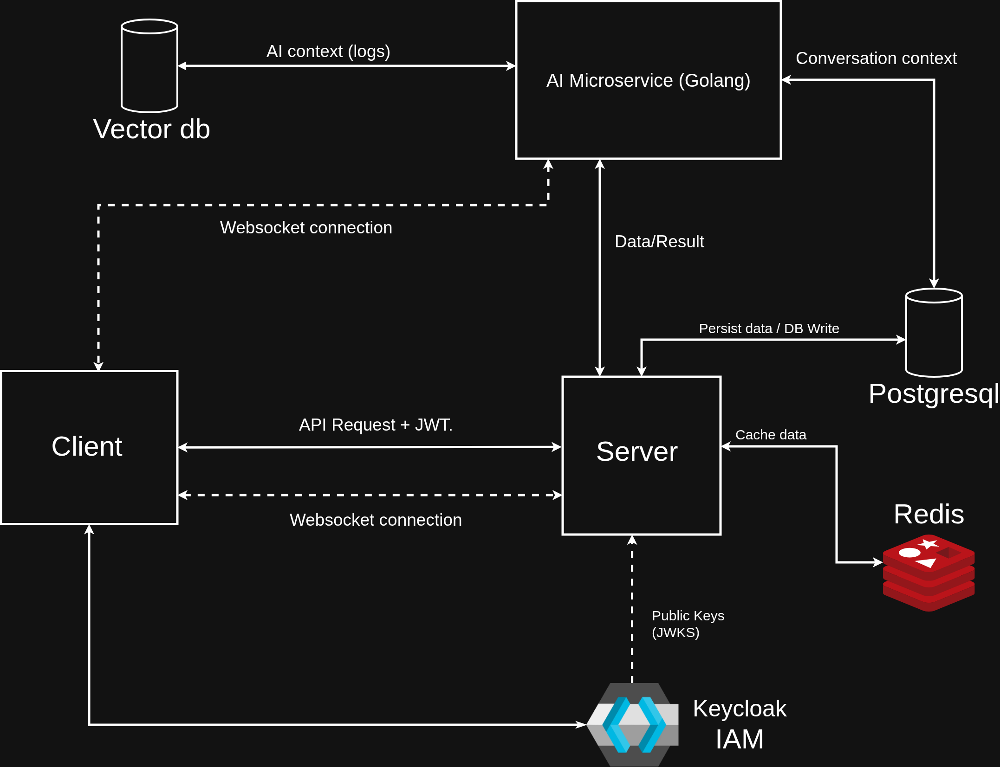

# SoloPlanner

SoloPlanner is a next-generation project planning and task management application (similar to Jira and Trello) featuring a deeply integrated **AI Project Manager & Scrum Master (PM/SM)**.

Unlike traditional planners where users must manually click through forms to update tasks, SoloPlanner allows users to interact with an AI Assistant via chat to manage their workflow. The AI acts as a smart PM/SM by:

- Interpreting natural language commands (e.g., _"Delay the database migration task by 2 days"_).
- Checking for schedule blockages, resource overallocation, or missing dependencies.
- Updating the project board, sprints, and task states directly through tool function calls.
- Conducting Scrum rituals (Daily Standups, Sprint Planning, Retrospectives) via interactive chat.

---

## Architecture & Tech Stack

SoloPlanner is built using a modern, decoupled microservices-based architecture:



### 1. Backend (Java)

- **Framework**: Spring Boot 4.0.6 / Java 21
- **API & WebSocket**: Spring Web MVC REST endpoints & Spring WebSocket + STOMP broker.
- **Data Layer**: Spring Data JPA + Hibernate + PostgreSQL.
- **Authentication**: Keycloak OIDC (OAuth2 Authorization Code Flow with HttpOnly cookies).

### 2. AI Microservice (Go)

- **Framework & Runtime**: Go 1.24.4
- **LLM Client**: `tmc/langchaingo` v0.1.14 utilizing Ollama (running the `gemma4` model).
- **Communication**: WebSocket server (`gorilla/websocket`) for real-time streaming of AI responses to the browser.
- **Tool Calling**: Invokes REST endpoints on the Java backend via a custom tool registry.

### 3. Frontend (React)

- **Framework**: React 19 + TypeScript / Vite 8
- **Drag & Drop**: `@atlaskit/pragmatic-drag-and-drop` v1.8
- **State Management**: React `useReducer` with `localStorage` persistence.

---

## Directory Structure

```text
SoloPlanner/
├── agent_context/          # AI Context and system documents
├── AI_microservice/        # Go AI service (LLM tool-calling orchestrator)
├── backend/
│   └── planner_helper/     # Spring Boot backend application
├── docker/                 # Container infrastructure files (PostgreSQL, Keycloak, etc.)
└── frontend/
    └── planner_frontend/   # React + Vite frontend client
```

---

## Getting Started

### Prerequisites

Make sure you have the following installed on your machine:

- **Docker** & **Docker Compose**
- **Java 21 (JDK)** & Maven (uses wrapper `./mvnw`)
- **Go 1.24.4+**
- **Node.js** & **pnpm** (Package manager for the frontend)

---

### Step 1: Spin Up the Infrastructure

Start the database, authentication server, and Ollama service using Docker Compose:

```bash
docker compose -f docker/docker_setup.yml up -d
```

To watch the initialization sidecar download the `gemma4` LLM model, run:

```bash
docker logs -f planner_ollama_init
```

---

### Step 2: Configure & Start the Java Backend

Navigate to the backend directory and run the application:

```bash
cd backend/planner_helper
./mvnw spring-boot:run
```

_The backend service starts on **port 8081** by default._

#### Backend Environment Snippet (`application.yml`)

```yaml
spring:
  datasource:
    url: jdbc:postgresql://localhost:5432/soloplanner
    username: soloplanner_user
    password: soloplanner_pass
  data:
    redis:
      host: localhost
      port: 6379
      password: redis_pass
  security:
    oauth2:
      resourceserver:
        jwt:
          issuer-uri: http://localhost:8080/realms/planner
```

---

### Step 3: Configure & Start the Go AI Microservice

Navigate to the AI microservice directory and execute the Go binary:

```bash
cd AI_microservice
go run .
```

_The AI service starts on **port 8090**._

#### AI Environment Variables

- `OLLAMA_HOST` (Default: `http://localhost:11434`)
- `OLLAMA_MODEL` (Default: `gemma4`)
- `JAVA_BACKEND_URL` (Default: `http://localhost:8081`)
- `INTERNAL_SECRET` (Default: `changeme` — used for communication security)
- `PORT` (Default: `8090`)

---

### Step 4: Build & Launch the Frontend

Navigate to the frontend directory, install dependencies, and start the development server:

```bash
cd frontend/planner_frontend
pnpm install
pnpm dev
```

_Open [http://localhost:5173](http://localhost:5173) in your browser._

---

## Port Configuration Reference (Development)

| Service                | Port       | Description                            |
| :--------------------- | :--------- | :------------------------------------- |
| **React Frontend**     | `5173`     | User Interface                         |
| **Java Spring Boot**   | `8081`     | Core REST API & WebSocket STOMP Broker |
| **Go AI Microservice** | `8090`     | LLM Orchestrator & Chat WebSocket      |
| **Keycloak**           | `8080`     | IAM & User Management Console          |
| **PostgreSQL**         | `5432`     | System Database                        |
| **Keycloak DB Schema** | `keycloak` | DB schema inside PostgreSQL            |
| **Redis**              | `6379`     | Cache & Session Store                  |
| **Ollama**             | `11434`    | Inference Engine                       |

---

## Development Guidelines

1. **Strict Layer Separation**:
   - Handlers/Controllers process HTTP/REST request/response mapping only.
   - Services implement all business logic, validation, and transition checks.
   - Repositories deal solely with data persistence.
2. **AI Error Handlers**:
   - If a backend service request fails, return descriptive HTTP statuses (`4xx` or `5xx`) and detailed error messages. The Go microservice catches these and feeds them back as tool feedback to the LLM so it can explain issues in natural language.
3. **Secrets Management**:
   - **Important**: Keycloak client secrets are currently hardcoded for local testing. Move them to environment variables or use Spring profile-based configuration before running in staging/production.
4. **Ordering Algorithm**:
   - Task ordering uses base-36 lexicographical ordering. Avoid editing task positioning logic without handling space-exhaustion (see the TODO in `TaskService.java`).
